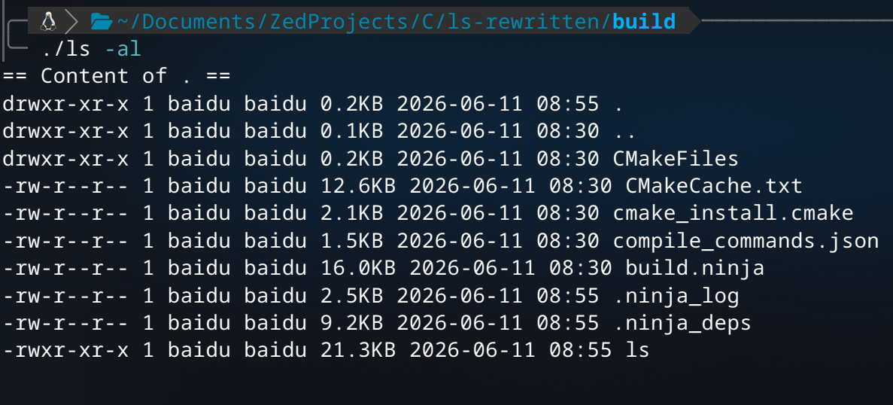

# ls-rewritten

Just some personal C project to learn the language, inspired by [Tony's C tutorial](https://www.youtube.com/watch?v=GqEeOrDk5DI).

This is basically temu version `ls` command provided by `GNU Core Utils`.



## Features

- List directory contents (default: current directory)
- `-a` — show hidden files (`.` prefix)
- `-l` — verbose output (permissions, owner, group, size, mtime)
- Multiple path arguments

## Usage

```
ls [-al] [path...]
```

## Download

[Download here if you don't want to compile](https://github.com/user/repo/releases/download/v1.0.0/ls-rewritten-linux-x86_64)

## Build

```bash
./scripts/configure-release.sh
./scripts/build-release.sh
```
